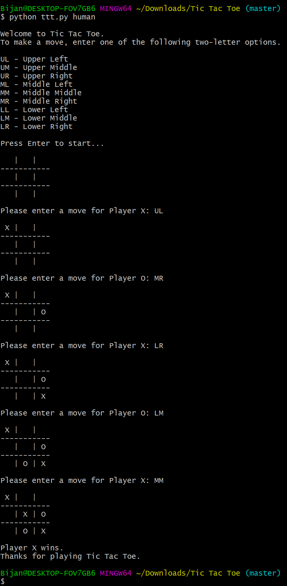
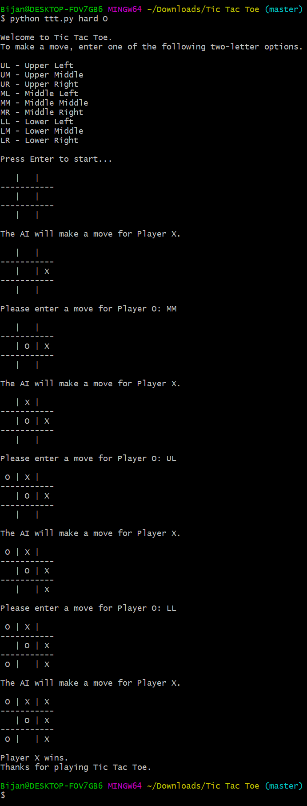

# Tic-Tac-Toe
This is a simple command line Tic-Tac-Toe game. Run it with
```
$ python3 ttt.py MODE [SYMBOL]
```
where `MODE` is one of `human`, `easy`, `medium`, and `hard`. The `human` mode is a two-player version of Tic-Tac-Toe, while the other
modes are single-player against AI of varying difficulty. The `easy` AI plays randomly, whereas the `hard` AI plays optimally using
the minimax algorithm with alpha-beta pruning. In `medium` mode, the AI plays each of these strategies (random and minimax) with 
probability 0.5 on each turn. When choosing a single-player mode, there is an option to choose which symbol (X or O) you would like to
use. If no symbol is chosen, it will be decided randomly.

# Screenshots

|  |  |
| ---------------------------------------- | ---------------------------------- |